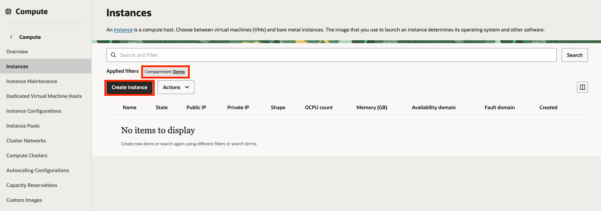
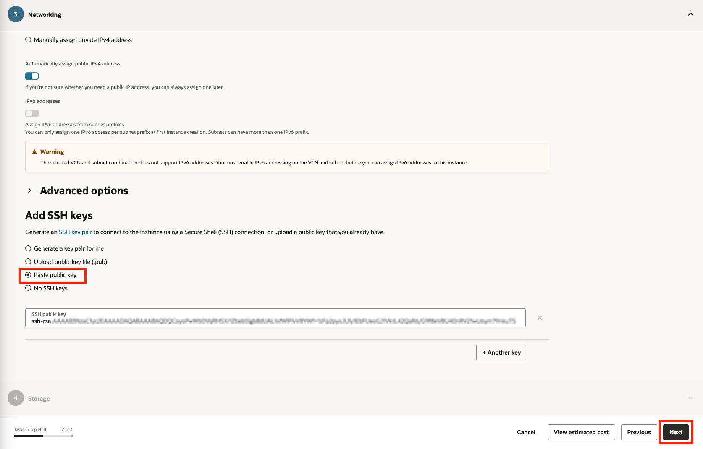
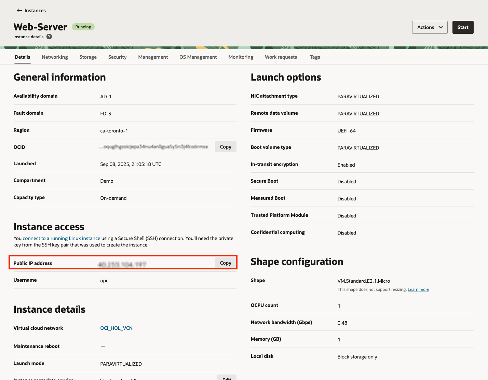
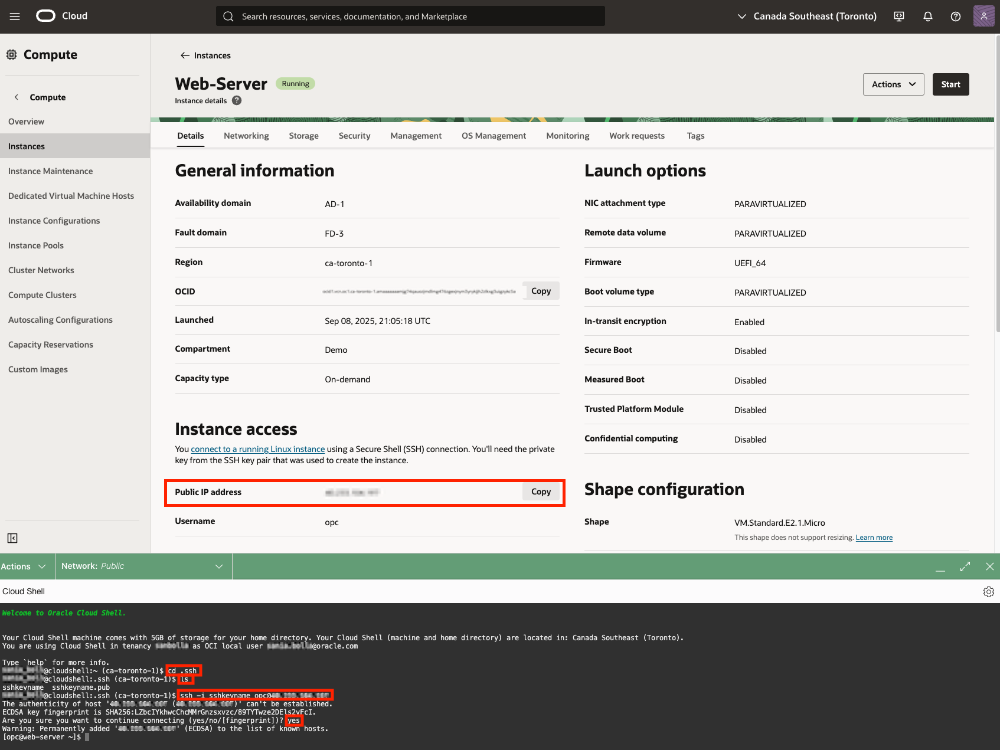
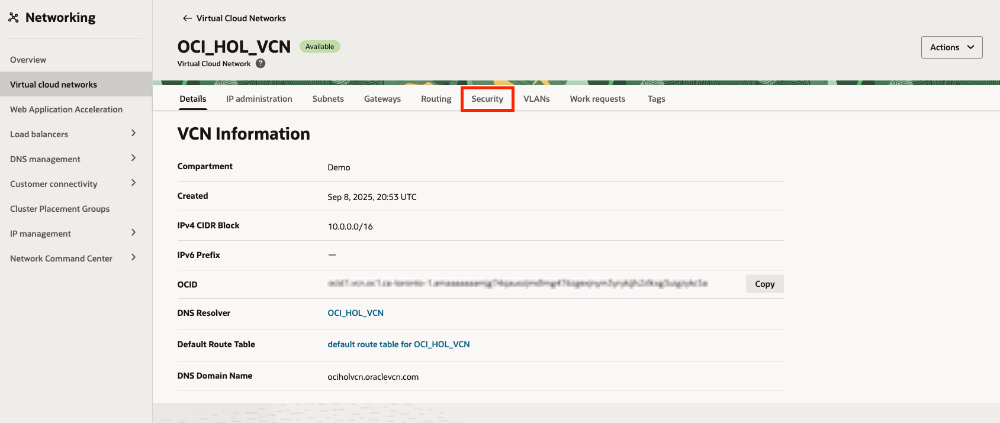
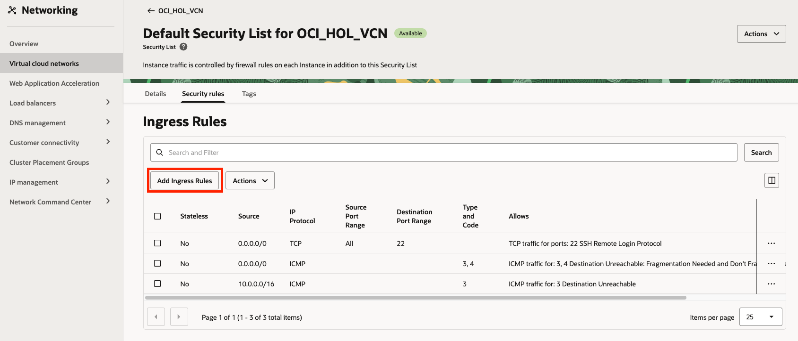
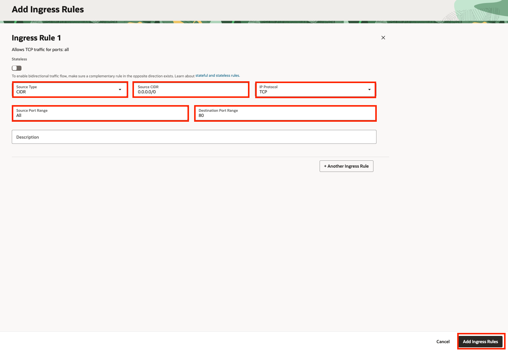

# Create a Compute Service

## Introduction

Oracle Cloud Infrastructure Compute lets you provision and manage compute hosts, known as instances. You can launch instances as needed to meet your compute and application requirements. After you launch an instance, you can access it securely from your computer, restart it, attach and detach volumes, and terminate it when you're done with it. Any changes made to the instance's local drives are lost when you terminate it. Any saved changes to volumes attached to the instance are retained.

Be sure to review [Best Practices for Your Compute Instance](https://docs.cloud.oracle.com/iaas/Content/Compute/References/bestpracticescompute.htm) for important information about working with your Oracle Cloud Infrastructure Compute instance.

Estimated Time: 30 minutes

Watch the video below for a quick walk-through of the lab.

[Create a Compute Service](videohub:1_zvp51wx4)

### Objectives
In this lab, you will:
- Create a compute instance
- Connect to the compute instance
<if type="freetier">- Install Apache HTTP server</if>

### Prerequisites

* An Oracle Cloud Account - please view this workshop's LiveLabs landing page to see which environments are supported.

>**Note:** If you have a **Free Trial** account, when your Free Trial expires, your account will be converted to an **Always Free** account. You will not be able to conduct Free Tier workshops unless the Always Free environment is available. 

**[Click here for the Free Tier FAQ page.](https://www.oracle.com/cloud/free/faq.html)**
  
## Task 1: Create <if type="freetier">a Web Server on </if>a Compute Instance

Oracle Cloud Infrastructure  offers both Bare Metal and Virtual Machine instances:

- **Bare Metal**  - A bare metal compute instance gives you dedicated physical server access for highest performance and strong isolation.
- **Virtual Machine**  - A Virtual Machine (VM) is an independent computing environment that runs on top of physical bare metal hardware. The virtualization makes it possible to run multiple VMs that are isolated from each other. VMs are ideal for running applications that do not require the performance and resources (CPU, memory, network bandwidth, storage) of an entire physical machine.

An Oracle Cloud Infrastructure VM compute instance runs on the same hardware as a Bare Metal instance, leveraging the same cloud-optimized hardware, firmware, software stack, and networking infrastructure.

1. Click the **Navigation Menu** in the upper left. Navigate to **Compute**, and select **Instances**.

	

<if type="livelabs">
2. Select the Compartment that you were assigned when the reservation was created.

  
</if>

2. Then click **Create Instance**. We will launch a VM instance for this lab.
  

3. The Create Compute Instance wizard will launch.
    <if type="freetier">Enter **Web-Server** as the name of the server. Click **Next** to get to the **Networking** section.</if>
    <if type="livelabs">Enter your username + *-Instance* as the name of the server.</if>

    <if type="freetier">
    
    </if>
    <if type="livelabs">
    
    </if>

<if type="livelabs">
4. Click *Change Shape* to choose a VM shape.

    

5. Select *Specialty and previous generation*, then select **VM.Standard.2.1** as the shape, and click **Select Shape**.

    
    </if>

3. In the Networking section, most of the defaults are perfect for our purposes. However, ensure that the **Automatically assign a public IPv4 address** option is selected.

    <if type="freetier">
    </if>

    <if type="livelabs">
    </if>

    >**Note:** You need a public IP address, so that you can SSH into the running instance later in this lab.

4. Scroll down to the **Add SSH keys** area of the page. Select **Paste public keys** and paste the SSH key that you created earlier in the ***Generate SSH Keys*** Lab. Press the **Create** button to create your instance.

    

    Launching an instance is simple and intuitive with few options to select. The provisioning of the compute instance will complete in less than a minute, and the instance state will change from *PROVISIONING* to *RUNNING*.

5. Once the instance state changes to *RUNNING*, you can SSH to the Public IP address of the instance. The Public IP address is noted under *Instance Access*.

    <if type="freetier">
    </if>

    <if type="livelabs">
    </if>

## Task 2: Connect to the Instance <if type="freetier">and Install Apache HTTP Server</if>

>**Note**: You may need to log in as the *admin* user to use cloud shell.

1. To connect to the instance, use Cloud Shell and enter the following command:

    >**Note:** For Oracle Linux VMs, the default username is **opc**

    ```
    <copy>ssh -i <private_ssh_key> opc@<public_ip_address></copy>
    ```

    

<if type="freetier">    
2. For this lab, we are going to install an Apache HTTP Webserver and try to connect to it over the public Internet. *Make sure you have SSH'ed into the Linux instance* and run the following commands:

    >**Note:** Apache HTTP Server is an open-source web server developed by the Apache Software Foundation. The Apache server hosts web content, and responds to requests for this content from web browsers such as Chrome or Firefox.

    - Install Apache http

        ```
        <copy>sudo yum install httpd -y</copy>
        ```

    - Start the apache server and configure it to start after system reboots

        ```
        <copy>sudo apachectl start
        sudo systemctl enable httpd</copy>
        ```

    - Run a quick check on apache configurations

        ```
        <copy>sudo apachectl configtest</copy>
        ```

    - Create firewall rules to allow access to the ports on which the HTTP server listens

        ```
        <copy>sudo firewall-cmd --permanent --zone=public --add-service=http
        sudo firewall-cmd --reload</copy>
        ```

    - Create an index file for your web server

        ```
        <copy>sudo bash -c 'echo This is my Web-Server running on Oracle Cloud Infrastructure >> /var/www/html/index.html'</copy>
        ```

3. Open your browser and navigate to `http://<public_ip_address>` (the IP address of the Linux VM)

    >**Note:** Your browser will not return anything because port 80 was not opened into the Security Lists

4. Click the **Navigation Menu** in the upper left. Navigate to **Networking**, and select **Virtual Cloud Networks**. Then click on the VCN name you created for this practice.

	

5. Now click **Security** on the top navigation bar for the VCN.

    

6. Click on the **Default Security List**.

7. Now click **Security rules** on the top navigation bar.

    

8. Click **Add Ingress Rules**

    

9. Here you need to open port 80. Add the following values as shown below:

    - **Source Type:** CIDR
    - **Source CIDR**: 0.0.0.0/0
    - **IP Protocol:** TCP
    - **Source Port Range:** All
    - **Destination Port Range:** 80
    - Click **Add Ingress Rules** at the bottom

    


10. Navigate to `http://<public_ip_address>` (the IP address of the Linux VM) in your browser. And now you should see the index page of the web server we created above.

    

## Troubleshooting

1. If you are unable to see the webserver on your browser, possible scenarios include:

    - VCN Security Lists is blocking traffic, Check VCN Security List for ingress rule for port 80
    - Firewall on the linux instance is blocking traffic

        - `# sudo firewall-cmd --zone=public --list-services` (this should show http service as part of the public zone)
        - `# sudo netstat -tulnp | grep httpd` (an httpd service should be listening on the port 80, if it’s a different port, open up that port on your VCN SL)

    - Your company VPN is blocking traffic

2. If you cannot successfully run the `sudo` commands, please make sure you have SSH'ed into your compute instance by following Task 2 -> Step 1.
</if>

You have completed this lab. You may now **proceed to the next lab**.

## Acknowledgements

- **Author** - Rajeshwari Rai, Prasenjit Sarkar 
- **Contributors** - Oracle LiveLabs QA Team (Kamryn Vinson, QA Intern, Arabella Yao, Product Manager, DB Product Management)
- **Last Updated By/Date** - Sania Bolla, September 2025
